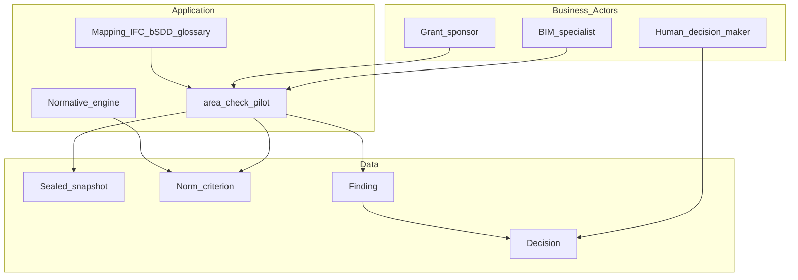

# ArchiMate — контекст AVGALAXY (v0)

Слои упрощённо (для витрины; не полный Tobit).

```mermaid
flowchart TB
  subgraph stakeholders [Business_Actors]
    Human[Human_decision_maker]
    Grant[Grant_sponsor]
    BIMSpec[BIM_specialist]
  end
  subgraph app [Application]
    Pilot[area_check_pilot]
    NormEng[Normative_engine]
    Mapping[Mapping_IFC_bSDD_glossary]
  end
  subgraph data [Data]
    Snapshot[Sealed_snapshot]
    Criterion[Norm_criterion]
    Finding[Finding]
    Decision[Decision]
  end
  Human --> Decision
  BIMSpec --> Pilot
  Grant --> Pilot
  Pilot --> Snapshot
  Pilot --> Criterion
  Pilot --> Finding
  Finding --> Decision
  Mapping --> Pilot
  NormEng --> Criterion
```

**Принцип:** finding без human decision не «закрыт». Geometry_basis явен (не вид экрана).
